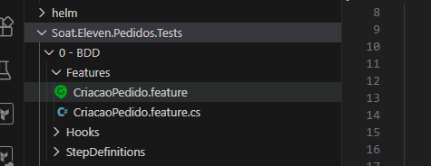
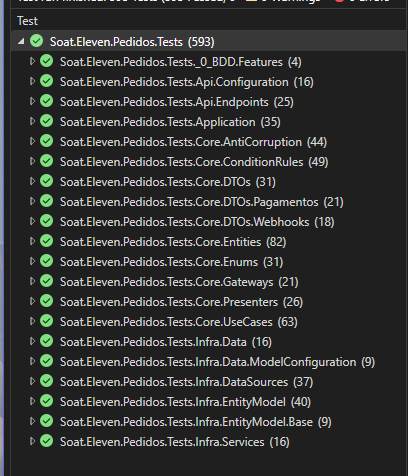

# FastFood Pedido - Microsserviço de Pedidos

## Sobre o Projeto

Este repositório contém o **microsserviço de Pedidos e Pagamentos** da solução **FastFood**, uma aplicação desenvolvida para lanchonetes de fast food como parte do projeto de pós-graduação em **Arquitetura de Software** da **FIAP**.

O microsserviço é responsável pelo gerenciamento completo do ciclo de vida dos pedidos, desde a criação até o pagamento, integrando-se com outros microsserviços da solução FastFood.

---

## Tecnologias Utilizadas

- **.NET 8** - Framework principal da aplicação
- **PostgreSQL** - Banco de dados relacional
- **Entity Framework Core** - ORM para acesso a dados
- **Docker** - Containerização da aplicação
- **Kubernetes** - Orquestração de containers
- **Helm** - Gerenciamento de pacotes Kubernetes
- **GitHub Actions** - CI/CD e pipelines de automação
- **SonarCloud** - Análise de qualidade de código
- **SpecFlow** - Framework para testes BDD

---

## Estrutura do Projeto

```
soat.eleven.fastfood.pedido/
├── src/
│   ├── Soat.Eleven.FastFood.Api/           # Camada de API (Endpoints REST)
│   │   ├── Configuration/                   # Configurações da aplicação
│   │   ├── Endpoints/                       # Definição dos endpoints REST
│   │   └── Program.cs                       # Ponto de entrada da aplicação
│   │
│   ├── Soat.Eleven.FastFood.Application/   # Camada de Aplicação
│   │   └── Controllers/                     # Controllers da aplicação
│   │
│   ├── Soat.Eleven.FastFood.Core/          # Camada de Domínio (Core)
│   │   ├── AntiCorruption/                  # Camada anticorrupção
│   │   ├── ConditionRules/                  # Regras de condição
│   │   ├── DTOs/                            # Data Transfer Objects
│   │   ├── Entities/                        # Entidades de domínio
│   │   ├── Enums/                           # Enumeradores
│   │   ├── Gateways/                        # Interfaces de gateways
│   │   ├── Interfaces/                      # Interfaces do domínio
│   │   ├── Presenters/                      # Presenters
│   │   └── UseCases/                        # Casos de uso
│   │
│   └── Soat.Eleven.FastFood.Infra/         # Camada de Infraestrutura
│       ├── Data/                            # Contexto de dados
│       ├── DataSources/                     # Fontes de dados
│       ├── EntityModel/                     # Modelos de entidade
│       ├── Gateways/                        # Implementações de gateways
│       ├── Migrations/                      # Migrações do banco de dados
│       └── Services/                        # Serviços de infraestrutura
│
├── Soat.Eleven.FastFood.Tests/             # Projeto de Testes
│   ├── 0 - BDD/                             # Testes BDD (Behavior Driven Development)
│   ├── Api/                                 # Testes da camada de API
│   ├── Application/                         # Testes da camada de Aplicação
│   ├── Core/                                # Testes da camada Core
│   └── Infra/                               # Testes da camada de Infraestrutura
│
├── helm/
│   └── fastfood-chart/                      # Chart Helm para deploy no Kubernetes
│       ├── templates/                       # Templates Kubernetes
│       └── values.yaml                      # Valores de configuração
│
├── docker-compose.yml                       # Configuração Docker Compose
├── Dockerfile                               # Dockerfile da aplicação
└── README.md
```

---

## Testes BDD (Behavior Driven Development)

Os testes BDD estão localizados na pasta `Soat.Eleven.FastFood.Tests/0 - BDD/` e utilizam o framework **SpecFlow** para definição de cenários em linguagem Gherkin.

### Estrutura dos Testes BDD

- **Features/** - Arquivos `.feature` com os cenários de teste escritos em Gherkin
- **StepDefinitions/** - Implementação dos passos definidos nas features
- **Hooks/** - Configurações e hooks do ciclo de vida dos testes

Os testes BDD permitem descrever o comportamento esperado do sistema em uma linguagem natural, facilitando a comunicação entre desenvolvedores, QA e stakeholders.

---

## Testes de Unidade

O projeto possui uma ampla cobertura de **testes de unidade** distribuídos nas camadas da aplicação, garantindo a qualidade e confiabilidade do código.

### Tecnologias e Ferramentas

- **xUnit** - Framework de testes unitários para .NET
- **Moq** - Biblioteca para criação de mocks e stubs
- **FluentAssertions** - Assertions fluentes para testes mais legíveis
- **Bogus** - Geração de dados fake para testes

### Cobertura de Código

O projeto mantém uma **cobertura de testes superior a 90%**, garantindo que a maior parte do código esteja coberta por testes automatizados. Esta cobertura abrange:

- Testes da camada de **API** - Validação de endpoints e configurações
- Testes da camada de **Application** - Validação dos controllers e orquestração
- Testes da camada de **Core** - Validação de entidades, casos de uso e regras de negócio
- Testes da camada de **Infra** - Validação de repositórios, gateways e serviços

### Visualização da Cobertura




*A imagem acima demonstra a cobertura detalhada dos testes por camada da aplicação.*

---

## Deploy e Infraestrutura

### Docker

Para executar a aplicação localmente com Docker:

```bash
docker-compose up -d
```

### Kubernetes com Helm

O projeto inclui um chart Helm em `helm/fastfood-chart/` para deploy no Kubernetes.

Para instalar o chart:

```bash
helm install fastfood-pedido ./helm/fastfood-chart
```

### CI/CD com GitHub Actions

O projeto utiliza **GitHub Actions** para automação de:
- Build e testes automatizados
- Análise de código com SonarCloud
- Build de imagens Docker
- Deploy automatizado no Kubernetes

### Qualidade de Código com SonarCloud

O projeto está integrado ao **SonarCloud** para análise contínua de qualidade de código. As seguintes métricas são monitoradas:

- **Cobertura de Código** - Mínimo de **80%** de cobertura de testes
- **Code Smells** - Identificação de possíveis problemas no código
- **Vulnerabilidades** - Análise de segurança
- **Duplicações** - Detecção de código duplicado

O pipeline de CI/CD impede o merge de código que não atinja a cobertura mínima de 80%.

---

## Pré-requisitos

- .NET 8 SDK
- Docker e Docker Compose
- PostgreSQL (ou usar via Docker)
- Kubernetes e Helm (para deploy em cluster)

---

## Como Executar Localmente

1. Clone o repositório:
```bash
git clone https://github.com/seu-usuario/soat.eleven.fastfood.pedido.git
```

2. Configure a connection string do PostgreSQL no `appsettings.json`

3. Execute as migrações do banco de dados:
```bash
dotnet ef database update --project src/Soat.Eleven.FastFood.Infra
```

4. Execute a aplicação:
```bash
dotnet run --project src/Soat.Eleven.FastFood.Api
```

---

## Executando os Testes

Para executar todos os testes:

```bash
dotnet test
```

Para executar apenas os testes BDD:

```bash
dotnet test --filter "Category=BDD"
```

---

## Arquitetura

O projeto segue os princípios de **Clean Architecture**, separando as responsabilidades em camadas:

- **API** - Camada de apresentação com endpoints REST
- **Application** - Orquestração dos casos de uso
- **Core** - Regras de negócio e entidades de domínio
- **Infra** - Implementações de infraestrutura e acesso a dados

---

## Licença

Este projeto foi desenvolvido para fins acadêmicos como parte da pós-graduação em Arquitetura de Software da FIAP.

---

